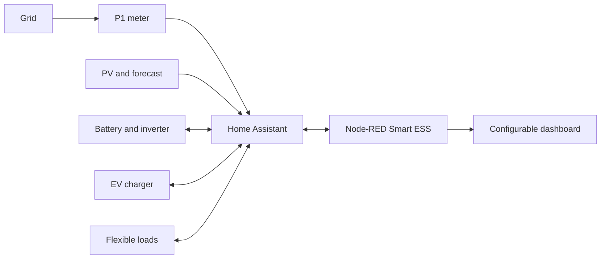

# Smart ESS

**English** | [Nederlands](README.nl.md)

Smart ESS is a configurable energy dashboard and control system for Home Assistant and Node-RED. It combines grid metering, solar generation, a home battery, EV charging, dynamic electricity prices, and flexible loads in one local interface.

This repository contains neutral defaults only. Names, addresses, IP addresses, serial numbers, tokens, and actual Home Assistant entity IDs belong in the local configuration and must never be committed to Git.

## What is included

### Dashboard

- **Overview** with live energy flows, data quality, alerts, EV quick actions, and navigation.
- **Solar & grid** with P1 import/export, phase loads, current production, daily totals, and forecasts for today and tomorrow.
- **Battery & inverter** with SOC, charge and discharge power, export limitation, reserve profiles, and smart grid charging.
- **EV & charging** with charging status, charging power, departure SOC, solar SOC, departure time, price planning, and a 15-minute timeline.
- **Loads** with current power and protected control of a configurable flexible load.
- **Lighting** with eight configurable lighting zones, on/off control, and brightness.
- **Climate** with configurable cooling, heating, heat-pump, and domestic-hot-water zones.
- **System** with data quality, warnings, and optional NAS status.
- **Configuration** for modules, installation limits, and Home Assistant entity mappings.

### Energy control

- P1 main meter as the source for total grid power, all three phases, and official import/export values.
- Fast local inverter measurement with P1 as an independent fallback source.
- Detection of missing, invalid, and stale measurements.
- Correction of known unrealistic power scaling, with a visible warning.
- Whole-home energy balance without depending on an inverter load circuit that may cover only part of the property.
- Actual and forecast solar generation from up to three configurable PV/Forecast.Solar sources.
- Learned consumption forecast for tomorrow, including planned EV and home-battery charging.
- Daily comparison of predicted and actual solar generation, including a correction factor.

### Smart EV charging

- Automatic solar- and price-based charging within configurable current and grid-connection limits.
- Separate guaranteed departure SOC and maximum SOC for solar charging.
- Selection of the cheapest 15-minute slots before the configured departure time.
- Minimum continuous charging blocks of 30 minutes.
- No automatic phase switching during normal charging; switching is allowed only when demonstrably required by the charging plan.
- Immediate charging uses the maximum safely available power.
- Start verification, confirmation of actual charging power, limited recovery attempts, and fault reporting.
- P1 power as a fast fallback when the charger does not publish current power promptly.
- The immediate-charge-to-100% override is cancelled when the vehicle is disconnected.
- SOC estimation while charging when the vehicle cloud temporarily lags behind.

### Home battery and hybrid inverter

- Export limitation with **Automatic**, **Manual on**, and **Manual off** modes.
- Configurable export buffer; by default, a small amount of export remains allowed.
- EV priority: export limitation stays disabled while a connected EV has not yet reached its solar SOC target.
- Smart grid charging based on current SOC, expected household reserve, usable solar surplus, charging losses, battery wear, and 15-minute prices.
- Only the calculated energy shortfall is scheduled in economically worthwhile low-price slots.
- Continuous replanning when SOC, price, or forecast data changes.
- **Automatic**, **Charge now**, and **Off**, with an adjustable target SOC and a rolling 24-hour timeline.
- Mutual interlocking between grid charging, export limitation, and additional battery discharge for EV charging.
- Additional discharge during EV charging only when the forecast leaves enough energy to recharge the home battery.
- **Eco**, **Normal**, and **EV priority** reserve profiles.
- Short-lived commands and safe fallback when Home Assistant, Node-RED, or Modbus becomes unavailable.
- Historical sensors for requested and actual power, energy budget, cost, SOC, forecast, and decision reason.

### Control and reliability

- Configurable modules: energy, battery, inverter, EV, loads, lighting, climate, and NAS.
- Central mapping of logical roles to local Home Assistant entities.
- **Automatic mapping** wizard for high-confidence P1, Growatt, charger, vehicle, PV, lighting, climate, load, and NAS matches.
- Validation before saving; missing entities are reported on the configuration page.
- Local configuration is stored outside the repository.
- Safe allowlists for switch, lighting, and climate commands.
- Confirmed command status instead of a blindly optimistic dashboard.
- Automatic safe defaults after a Home Assistant or Node-RED restart.
- Optional GitHub monitor that reports a new commit but never installs it automatically.

## Quick start

Requirements:

- Home Assistant;
- Node-RED;
- `@flowfuse/node-red-dashboard`;
- `node-red-contrib-home-assistant-websocket`.

Steps:

1. Back up the existing Node-RED flows.
2. Install the two required Node-RED packages.
3. Import or use [flows.json](flows.json), and select the local Home Assistant server configuration on every Home Assistant node.
4. Deploy the flow.
5. Open `http://<node-red-host>:1880/endpoint/ess/configuratie`.
6. Select the modules, enter the installation limits, and optionally choose **Automatisch koppelen** (Automatic mapping).
7. Review the proposal, correct missing or incorrect roles manually, and only then choose **Opslaan** (Save).
8. Test every write command at low power and under supervision before enabling automatic control.

The overview is then available at:

```text
http://<node-red-host>:1880/endpoint/ess/overzicht
```

The configuration is stored locally as:

```text
/config/node-red/ess-system-config.json
/config/node-red/ess-system-config.backup.json
```

The first file is the primary configuration; the second is an automatically updated full local backup. After a pull, deploy, or Node-RED restart, the backup is loaded first and the primary configuration shortly afterwards, so the primary file always takes precedence. If it is missing, the backup remains active. A normal pull therefore does not require entity mapping to be repeated. New roles introduced by an update are safely added with neutral defaults while loading.

These paths match a typical Home Assistant installation. For a standalone Node-RED installation, point the read and write nodes to private local paths. A neutral example is available in [examples/ess-system-config.example.json](examples/ess-system-config.example.json).

## Supported integrations

The measurement layer is role-based: local entity IDs are assigned on the **Configuratie** (Configuration) page. Automatic mapping uses exact entity IDs, device characteristics, domains, and units. Existing valid mappings are preserved. Its result is only a proposal and is not saved until **Opslaan** (Save) is selected. Always verify write-capable roles for the WIT inverter, charger, and switches before enabling automatic control.

The import field also accepts a partial configuration, such as an `entities` object by itself. Imported values are merged into the currently open local profile; modules, limits, and mappings that were not included remain unchanged.

| Component | Current adapter | Notes |
| --- | --- | --- |
| Grid metering | Home Assistant P1 sensors | Total power and all three phases are configurable. |
| Inverter/battery | Growatt WIT through Home Assistant Modbus entities | Work modes, VPP, and export limitation use Growatt semantics. |
| EV charger | Easee through Home Assistant | Start/stop, current limit, and phase selection use these services. |
| Prices | Nord Pool sensor | 15-minute prices are processed locally. |
| Solar forecast | Forecast.Solar sensors | Up to three installations are combined. |
| Loads | Home Assistant switch/sensor | One controllable load and multiple power meters. |
| Lighting/climate | Home Assistant light/climate/water_heater | Targets come from the validated configuration. |
| NAS | Home Assistant NAS sensors | Entirely optional. |

Another inverter or charger brand can use the same dashboard roles, but write commands require a small brand-specific adapter. Keep the related automatic write modules disabled until a suitable adapter is available.

## Tested in practice

The reference installation used to develop and test these features includes:

- a three-phase Growatt WIT-HU hybrid inverter with an AXE home battery, controlled locally through the Growatt Modbus integration for Home Assistant;
- three separate PV inverters in addition to the WIT, read through the Growatt Server integration/API;
- a HomeWizard P1 Meter as the fast main meter and an additional HomeWizard power meter;
- two Easee chargers, including start, stop, current control, phase selection, and verification of actual charging power;
- Audi Connect through the Home Assistant Audi Connect integration for vehicle SOC, target SOC, position, lock, and charging planning;
- Tado heating zones and multiple Home Assistant `climate` entities for heating and cooling;
- Philips Hue lighting groups, a Samsung EHS heat pump/domestic-hot-water system, and a Synology DSM NAS;
- Forecast.Solar for solar forecasts and Nord Pool for dynamic 15-minute prices.

This is the tested combination, not a guarantee that every model, firmware version, or similarly named integration exposes the same entities and write commands. Always review automatically discovered mappings and initially test controls with safe limits and under supervision. Cloud integrations such as Growatt Server, Audi Connect, and Forecast.Solar may also be delayed, rate-limited, or temporarily unavailable; local P1 and Modbus measurements take priority wherever possible.

## Configurable installation limits

- number of phases and nominal voltage;
- main fuse rating per phase;
- usable battery capacity;
- nominal inverter power;
- maximum battery power;
- EV battery capacity;
- maximum charging current and planning power;
- desired small grid-import buffer;
- every Home Assistant entity used by the system;
- visible dashboard modules.

## Important notes

- This project does not replace residual-current, overcurrent, BMS, inverter, or charger protection.
- Verify the signs of grid and battery power: the controller assumes consistent import/export and charge/discharge directions.
- Verify the actual BMS and inverter limits. Dashboard values are never a reason to increase physical limits.
- An export limit can influence other inverters only indirectly. Export may still increase when the battery or inverter reaches its charging limit.
- Forecast.Solar remains a forecast. The measured correction factor helps but cannot guarantee a full battery.
- Dynamic price control accounts for charging losses and a battery-wear allowance; verify local taxes and supplier markups.
- Home Assistant Recorder determines how long effectiveness measurements and forecast deviations remain available.
- The configuration page writes a local JSON file. It may contain real names or entity IDs and is therefore listed in `.gitignore`.
- The primary configuration and automatic backup remain outside Git and are not overwritten by a pull.
- Never commit `flows_cred.json`, credential-bearing exports, Home Assistant backups, logs, or local configuration files.
- The current repository content is anonymized. Older commits may still contain historical names or identifiers. For maximum privacy, publish a new repository containing only a sanitized snapshot, or deliberately rewrite history; never do this without a backup.
- Make firmware or register changes only with documentation for the exact device model.

## Design



Node-RED is the only planner. The inverter, BMS, and charger remain responsible for hard safety limits. Write controllers interlock, act only on fresh data, and fall back to a safe state when confirmation is missing.

## Development and validation

Regenerate the dashboard after changing the generator:

```text
node scripts/build-multipage-dashboard.js
```

Then run the functional and privacy checks:

```text
npm test
```

The test compiles all Node-RED function nodes and validates connections, dashboard routes, protected actions, configuration, and unwanted personal data.

More details:

- [Node-RED installation and management](docs/node-red-project.md)
- [Dashboard data model and entity roles](docs/dashboard-data-contract.md)
- [Optional GitHub monitor](node-red/README.md)

The linked technical documents are currently written in Dutch.

## License and use

No open-source license has been added yet. Without a license, reuse remains legally restricted. Add a suitable license and liability disclaimer before broad public distribution.
