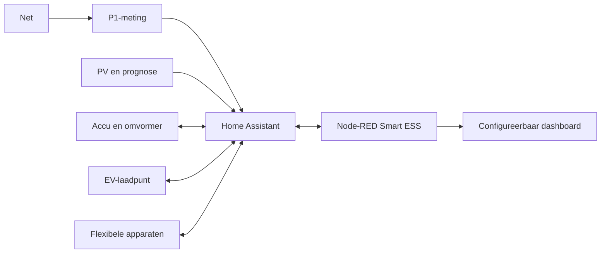

# Smart ESS

[English](README.md) | **Nederlands**

Smart ESS is een configureerbaar energiedashboard en regelsysteem voor Home Assistant en Node-RED. Het combineert netmeting, zonnepanelen, een thuisaccu, een laadpunt, dynamische prijzen en flexibele apparaten in één lokale bediening.

De repository bevat uitsluitend neutrale standaardwaarden. Namen, adressen, IP-adressen, serienummers, tokens en echte Home Assistant-entiteiten horen alleen in de lokale configuratie en nooit in Git.

## Wat is inbegrepen

### Dashboard

- **Overzicht** met actuele energiestromen, datakwaliteit, meldingen, EV-snelacties en navigatie.
- **Zon & net** met P1-import/export, fasebelasting, actuele productie, dagtotalen en verwachtingen voor vandaag en morgen.
- **Accu & omvormer** met SOC, laad- en ontlaadvermogen, exportbegrenzing, reserveprofielen en slim netladen.
- **EV & laden** met laadstatus, laadvermogen, vertrek-SOC, zonne-SOC, vertrektijd, prijsplanning en een kwartiertijdlijn.
- **Verbruikers** met actuele vermogens en een beveiligde bediening voor een configureerbare flexibele last.
- **Verlichting** met acht configureerbare lichtzones, aan/uit en dimniveau.
- **Klimaat** met configureerbare koel-, verwarmings-, warmtepomp- en tapwaterzones.
- **Systeem** met datakwaliteit, waarschuwingen en optionele NAS-status.
- **Configuratie** voor modules, installatiegrenzen en Home Assistant-entiteitskoppelingen.

### Energieregeling

- P1-hoofdmeter als bron voor totaal netvermogen, drie fasen en officiële import/export.
- Snelle lokale omvormermeting met P1 als onafhankelijke reservebron.
- Herkenning van ontbrekende, ongeldige en verouderde meetwaarden.
- Correctie van bekende onrealistische vermogensschalen, met zichtbare waarschuwing.
- Totale woningbalans zonder afhankelijk te zijn van een mogelijk beperkt load-circuit van de omvormer.
- Werkelijk en verwacht zonvermogen uit maximaal drie configureerbare PV/Forecast.Solar-bronnen.
- Geleerde verbruiksverwachting voor morgen, inclusief geplande EV- en thuisacculading.
- Dagelijkse vergelijking tussen zonverwachting en werkelijke productie, inclusief correctiefactor.

### Slim EV-laden

- Automatische zonne- en prijsregeling binnen configureerbare stroom- en aansluitgrenzen.
- Afzonderlijk gegarandeerd vertrek-SOC en maximaal SOC voor zonneladen.
- Selectie van de goedkoopste kwartieren vóór de ingestelde vertrektijd.
- Minimaal aaneengesloten laadblokken van een half uur.
- Geen automatische fasewissel tijdens normaal laden; alleen wanneer de planning dit aantoonbaar nodig heeft.
- Direct laden gebruikt het maximaal veilig beschikbare vermogen.
- Startcontrole, bevestiging van werkelijk laadvermogen, beperkte herstelpogingen en storingsmelding.
- P1-vermogen als snelle reserve wanneer de laadpaal zijn actuele vermogen niet tijdig publiceert.
- Direct-laden-naar-100%-override vervalt bij het loskoppelen van de auto.
- SOC-schatting tijdens laden wanneer de voertuigcloud tijdelijk achterloopt.

### Thuisaccu en hybride omvormer

- Exportbegrenzing met **Automatisch**, **Handmatig aan** en **Handmatig uit**.
- Configureerbare exportbuffer; standaard wordt een kleine terugleverruimte behouden.
- EV-voorrang: exportbegrenzing blijft uit wanneer een aangesloten EV zijn zonnedoel nog niet heeft bereikt.
- Slim netladen op basis van actuele SOC, verwachte woningreserve, bruikbaar zonne-overschot, laadverlies, slijtage en kwartierprijzen.
- Alleen het berekende energietekort wordt in rendabele goedkope kwartieren gepland.
- Doorlopende herberekening bij nieuwe SOC-, prijs- of prognosegegevens.
- **Automatisch**, **Nu laden** en **Uit**, met instelbaar doel-SOC en een 24-uurs tijdlijn.
- Onderlinge vergrendeling tussen netladen, exportbegrenzing en extra ontladen voor de EV.
- Extra ontladen tijdens EV-laden alleen wanneer de prognose voldoende herlaadruimte laat.
- Reserveprofielen **Eco**, **Normaal** en **EV voorrang**.
- Korte opdrachten en veilige terugval wanneer Home Assistant, Node-RED of Modbus uitvalt.
- Historische sensoren voor gevraagd/werkelijk vermogen, energiebudget, kosten, SOC, prognose en beslisreden.

### Bediening en betrouwbaarheid

- Configureerbare modules: energie, accu, omvormer, EV, verbruikers, verlichting, klimaat en NAS.
- Centrale koppeling van logische rollen aan lokale Home Assistant-entiteiten.
- Wizard **Automatisch koppelen** voor overtuigende P1-, Growatt-, laadpunt-, voertuig-, PV-, licht-, klimaat-, verbruiker- en NAS-matches.
- Validatie vóór opslaan; ontbrekende entiteiten worden in de configuratiepagina gemeld.
- Lokale configuratie wordt buiten de repository bewaard.
- Veilige allowlists voor schakel-, licht- en klimaatopdrachten.
- Bevestigingsstatus na een opdracht en geen blind optimistisch dashboard.
- Automatische veilige standaardstanden na een Home Assistant/Node-RED-herstart.
- Optionele GitHub-monitor die alleen een nieuwe commit meldt en nooit zelfstandig installeert.

## Snel starten

Benodigd:

- Home Assistant;
- Node-RED;
- `@flowfuse/node-red-dashboard`;
- `node-red-contrib-home-assistant-websocket`.

Stappen:

1. Maak een back-up van de bestaande Node-RED-flows.
2. Installeer de twee vereiste Node-RED-pakketten.
3. Importeer of gebruik [flows.json](flows.json) en selecteer bij alle Home Assistant-nodes de lokale serverconfiguratie.
4. Deploy de flow.
5. Open `http://<node-red-host>:1880/endpoint/ess/configuratie`.
6. Kies de modules, vul de installatiegrenzen in en kies desgewenst **Automatisch koppelen**.
7. Controleer het voorstel, pas ontbrekende of onjuiste rollen handmatig aan en kies pas daarna **Opslaan**.
8. Test iedere schrijfopdracht met lage vermogens en onder toezicht voordat automatische regeling wordt ingeschakeld.

Het overzicht staat daarna op:

```text
http://<node-red-host>:1880/endpoint/ess/overzicht
```

De configuratie wordt lokaal opgeslagen als:

```text
/config/node-red/ess-system-config.json
/config/node-red/ess-system-config.backup.json
```

Het eerste bestand is de hoofdconfiguratie; het tweede is een automatisch bijgewerkte volledige lokale back-up. Na een pull, deploy of Node-RED-herstart wordt eerst de back-up ingelezen en kort daarna de hoofdconfiguratie, zodat de hoofdconfiguratie altijd voorrang heeft. Als die ontbreekt, blijft de back-up actief. Daardoor is na een normale pull geen nieuwe entiteitskoppeling nodig. Nieuwe rollen uit een update worden tijdens het inlezen veilig met neutrale standaardwaarden aangevuld.

Deze paden passen bij de gebruikelijke Home Assistant-installatie. Bij een zelfstandige Node-RED-installatie moeten de lees- en schrijfnodes naar lokale privépaden worden aangepast. Een neutraal voorbeeld staat in [examples/ess-system-config.example.json](examples/ess-system-config.example.json).

## Ondersteunde koppelingen

De meetlaag is op rollen gebaseerd: lokale entiteitsnamen worden op de pagina **Configuratie** gekoppeld. De huidige schrijflaag bevat adapters voor:

De automatische koppeling gebruikt exacte entiteiten, apparaatkenmerken, domeinen en meeteenheden. Bestaande geldige koppelingen blijven behouden. Het resultaat is alleen een voorstel en wordt niet opgeslagen totdat **Opslaan** wordt gekozen. Vooral schrijfrollen voor WIT, laadpunt en schakelaars moeten vóór automatisch gebruik handmatig worden gecontroleerd.

Het importvak accepteert ook een deelconfiguratie, bijvoorbeeld alleen een `entities`-object. Die waarden worden samengevoegd met het geopende lokale profiel; niet-genoemde modules, grenzen en koppelingen blijven behouden.

| Onderdeel | Huidige adapter | Opmerking |
| --- | --- | --- |
| Netmeting | Home Assistant P1-sensoren | Totaal en drie fasen zijn configureerbaar. |
| Omvormer/accu | Growatt WIT via Home Assistant Modbus-entiteiten | Werkmodi, VPP en exportbegrenzing gebruiken Growatt-semantiek. |
| EV-laadpunt | Easee via Home Assistant | Start/stop, stroomlimiet en fasekeuze zijn op deze services gebaseerd. |
| Prijzen | Nord Pool-sensor | Kwartierprijzen worden lokaal verwerkt. |
| Zonverwachting | Forecast.Solar-sensoren | Maximaal drie installaties worden opgeteld. |
| Verbruikers | Home Assistant switch/sensor | Eén schakelbare last en meerdere vermogensmeters. |
| Licht/klimaat | Home Assistant light/climate/water_heater | Doelen komen uit de gevalideerde configuratie. |
| NAS | Home Assistant NAS-sensoren | Volledig optioneel. |

Een ander merk omvormer of laadpunt kan dezelfde dashboardrollen gebruiken, maar heeft voor schrijfopdrachten een kleine merkadapter nodig. Zonder passende adapter horen de bijbehorende automatische schrijfmodules uit te blijven.

## Praktisch getest met

De referentie-installatie waarop de functies daadwerkelijk zijn ontwikkeld en beproefd bevat:

- een driefase Growatt WIT-HU hybride omvormer met AXE-thuisaccu, lokaal aangestuurd via de Growatt Modbus-integratie voor Home Assistant;
- drie afzonderlijke PV-omvormers naast de WIT, uitgelezen via de Growatt Server-integratie/API;
- een HomeWizard P1 Meter als snelle hoofdmeter en een aanvullende HomeWizard-vermogensmeter;
- twee Easee-laadpunten, inclusief starten, stoppen, stroomregeling, fasekeuze en controle van het werkelijke laadvermogen;
- Audi Connect via de Home Assistant Audi Connect-integratie voor voertuig-SOC, doel-SOC, positie, slot en laadplanning;
- Tado-verwarmingszones en meerdere Home Assistant `climate`-entiteiten voor verwarming en koeling;
- Philips Hue-lichtgroepen, een Samsung EHS-warmtepomp/tapwaterregeling en een Synology DSM-NAS;
- Forecast.Solar voor de zonverwachting en Nord Pool voor dynamische kwartierprijzen.

Dit is de geteste combinatie, geen garantie dat ieder model, iedere firmwareversie of gelijknamige integratie dezelfde entiteiten en schrijfopdrachten aanbiedt. Controleer daarom altijd de automatisch gevonden koppelingen en test bediening eerst met veilige grenzen en onder toezicht. Cloudkoppelingen zoals Growatt Server, Audi Connect en Forecast.Solar kunnen bovendien vertraagd, begrensd of tijdelijk onbeschikbaar zijn; de lokale P1- en Modbusmetingen krijgen waar mogelijk voorrang.

## Configureerbare installatiegrenzen

- aantal fasen en nominale spanning;
- hoofdzekering per fase;
- bruikbare accucapaciteit;
- nominaal omvormervermogen;
- maximaal batterijvermogen;
- EV-accucapaciteit;
- maximale laadstroom en planningsvermogen;
- gewenste kleine netimportbuffer;
- alle gebruikte Home Assistant-entiteiten;
- zichtbare dashboardmodules.

## Belangrijke sidenotes

- Dit project vervangt geen aardlek-, overstroom-, BMS-, omvormer- of laadpaalbeveiliging.
- Controleer de tekens van net- en accuvermogen: de regeling veronderstelt vaste import/export- en laad/ontlaadrichtingen.
- Controleer de werkelijke BMS- en omvormerlimieten. Dashboardwaarden zijn nooit een reden om fysieke grenzen te verhogen.
- Een exportlimiet kan andere omvormers alleen indirect beïnvloeden. Als de accu of omvormer zijn laadlimiet bereikt, kan teruglevering alsnog hoger worden.
- Forecast.Solar blijft een voorspelling. De gemeten correctiefactor helpt, maar garandeert geen volle accu.
- Dynamische prijssturing rekent met laadverlies en een slijtagevergoeding; lokale belastingen en leveranciersopslagen moeten worden gecontroleerd.
- Home Assistant Recorder bepaalt hoe lang effectmetingen en prognoseafwijkingen beschikbaar blijven.
- De configuratiepagina schrijft een lokaal JSON-bestand. Dat bestand kan echte namen of entiteits-ID's bevatten en staat daarom in `.gitignore`.
- Het hoofdconfiguratiebestand en de automatische back-up blijven buiten Git en worden bij een pull niet overschreven.
- Commit nooit `flows_cred.json`, exports met credentials, Home Assistant-back-ups, logs of lokale configuratie.
- De huidige repository-inhoud is geneutraliseerd. Oude commits kunnen nog historische namen of identifiers bevatten. Publiceer voor maximale privacy een nieuwe repository met alleen een opgeschoonde momentopname, of herschrijf de geschiedenis bewust; doe dit niet zonder back-up.
- Voer firmware- of registerwijzigingen alleen uit met documentatie voor het exacte apparaatmodel.

## Ontwerp



Node-RED is de enige planner. De omvormer, het BMS en het laadpunt blijven verantwoordelijk voor harde veiligheidsgrenzen. Schrijfregelingen blokkeren elkaar, reageren alleen op verse data en vallen terug naar een veilige stand wanneer bevestiging ontbreekt.

## Ontwikkelen en controleren

Genereer het dashboard opnieuw na een wijziging aan de generator:

```text
node scripts/build-multipage-dashboard.js
```

Voer daarna de functionele en privacycontroles uit:

```text
npm test
```

De test compileert alle Node-RED-functionnodes, controleert verbindingen, dashboardroutes, beveiligde acties, configuratie en ongewenste persoonsgegevens.

Meer details:

- [Node-RED-installatie en beheer](docs/node-red-project.md)
- [Dashboard-datamodel en entiteitsrollen](docs/dashboard-data-contract.md)
- [Optionele GitHub-monitor](node-red/README.md)

## Licentie en gebruik

Er is nog geen opensourcelicentie toegevoegd. Zonder licentie blijft hergebruik juridisch beperkt. Voeg vóór brede publicatie een passende licentie en een aansprakelijkheidsverklaring toe.
